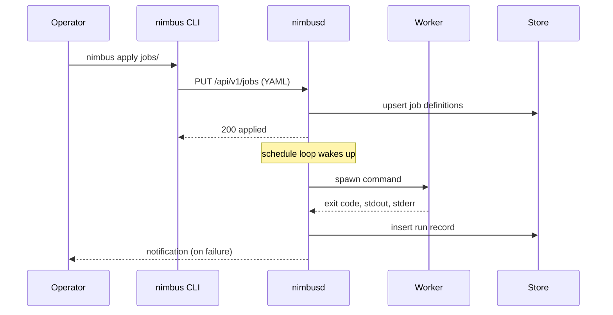

# Architecture

Nimbus is a single daemon, `nimbusd`, with two clients: the `nimbus` CLI and
the web UI served by the daemon itself. Both talk to the daemon over the
[HTTP API](../reference/http-api.md).

## Components

| Component | Runs where | Responsibility |
| --- | --- | --- |
| `nimbusd` | Server | Evaluates schedules, starts workers, records run history, serves the API. |
| Worker | Child process of `nimbusd` | Executes one job command with its timeout and environment. |
| Store | Embedded SQLite file in the data directory | Job definitions as last applied, run history, retry queue. |
| `nimbus` CLI | Operator machine | Applies job files, queries runs, triggers manual runs. |

## Applying a job and running it

## Design constraints

- **One daemon per data directory.** Nimbus does not cluster. Two daemons on
  the same directory will corrupt the store; the daemon takes a lock file to
  prevent this.
- **Schedules are evaluated in memory.** Restarting the daemon recomputes the
  next run of every job from the current time; missed runs during downtime are
  not replayed.
- **The store is the source of truth**, not the YAML files. `nimbus apply`
  copies the files into the store; deleting a file does not delete the job.
  Use `nimbus delete` for that.
