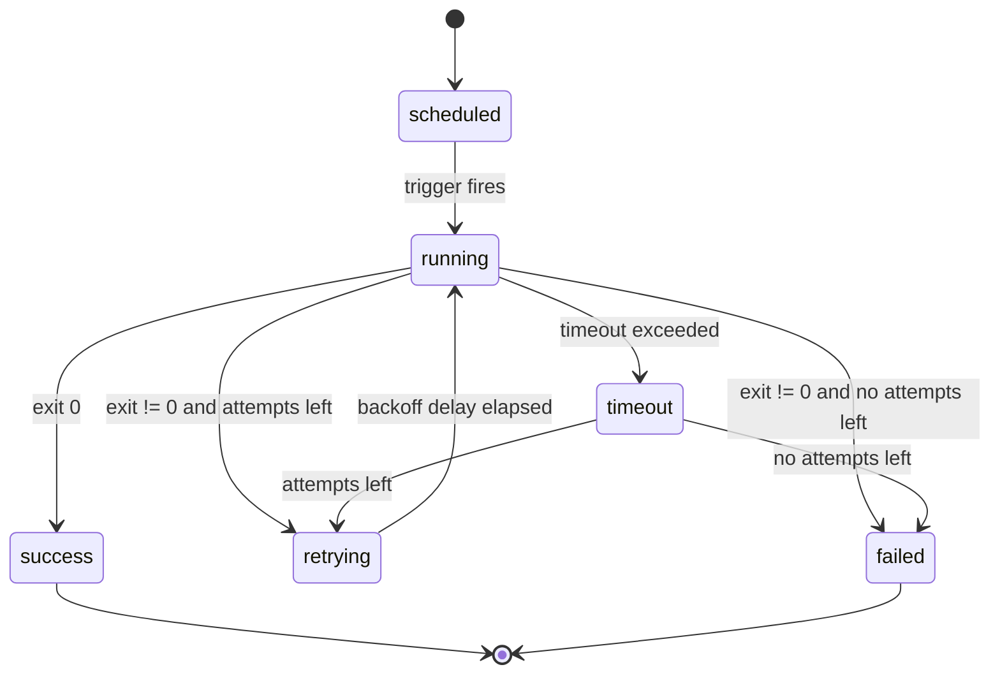

# Retries and backoff

A run fails when the command exits non-zero, is killed by the timeout, or
cannot be started at all. The `retries` block on a job controls what happens
next.

```yaml
retries:
  attempts: 3
  backoff: exponential
  initial_delay: 30s
  max_delay: 10m
```

## Options

| Key | Default | Description |
| --- | --- | --- |
| `attempts` | `0` | Additional attempts after the first failure. `0` disables retries. |
| `backoff` | `fixed` | `fixed` waits `initial_delay` every time. `exponential` doubles the delay after each attempt. |
| `initial_delay` | `1m` | Delay before the first retry. |
| `max_delay` | `1h` | Upper bound for exponential backoff. |

With the example above the retries happen after 30 seconds, 1 minute and
2 minutes. If all attempts fail, the run is recorded as `failed` and
`on_failure` notifications are sent once, not once per attempt.

## Run lifecycle



## Interaction with `concurrency`

A retry is part of the same run, so `concurrency: forbid` does not skip it.
However, if the next *scheduled* trigger fires while a retry is pending, that
trigger is skipped and logged as `skipped (previous run active)`.

:::tip
Use `nimbus runs --status failed --since 24h` to review everything that
exhausted its retries in the last day.
:::
