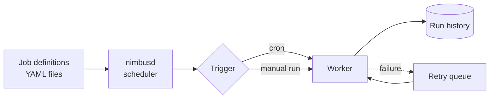

# Nimbus documentation

**Nimbus** is a small, self-hosted job scheduler. You describe jobs in YAML
files, Nimbus runs them on a schedule or on demand, retries them when they
fail, and keeps a history of every run.

:::info[This is a proof of concept]
Nimbus is a fictional product. This site exists to demonstrate a standalone
documentation site built with Docusaurus and published to GitHub Pages by
GitHub Actions. The documentation workflow is real; the software is not.
:::

## How it fits together

## Where to go next

| I want to... | Read |
| --- | --- |
| Install Nimbus and run my first job | [Installation](./getting-started/installation.mdx) and [Quickstart](./getting-started/quickstart.md) |
| Understand the job file format | [Defining jobs](./guides/defining-jobs.md) |
| Control what happens when a job fails | [Retries and backoff](./guides/retries-and-backoff.md) |
| Look up a command or config key | [CLI reference](./reference/cli.md), [Configuration](./reference/configuration.md) |
| Automate Nimbus from another system | [HTTP API](./reference/http-api.md) |
| Start a job from an HTTP request (new in 1.1) | [Webhooks](./guides/webhooks.md) |

Links in these docs are written as relative file paths (for example
`./guides/defining-jobs.md`). Docusaurus validates them at build time, so a
broken link fails the build instead of reaching readers.
